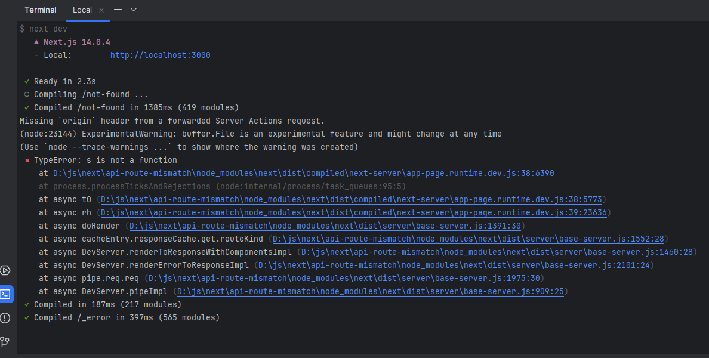
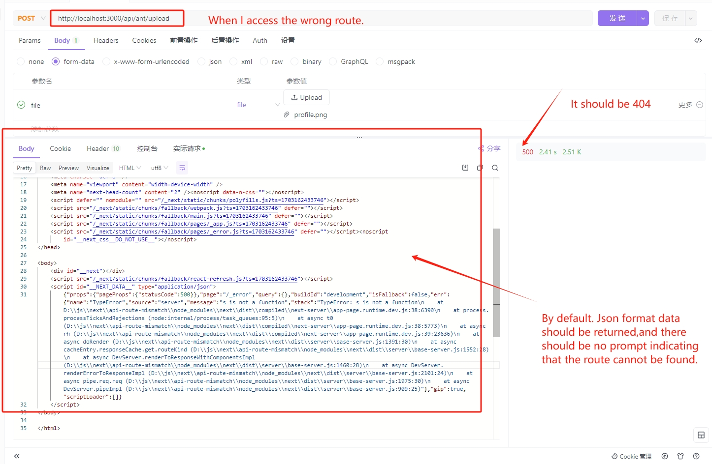

# api-route-mismatch
reproduce of api route mismatch in next.js

## How to reproduce

There is an api route /api/rest/upload in the project for file upload. When I accidentally enter the wrong routing
address, such as api/ant/upload, an error message appears: TypeError: s is not a function. This is not true. Expected to
happen.
At the same time, if the route cannot be recruited, there should be a friendly response. The request status and code
should be 404. At the same time, different response information should be returned under different data type requests to
provide a friendly reminder to the developer.

> When the api route does not match, the following error will occur.

> develop env:

node: v18.18.2

Os: windows 11

## Looking forward to returning:

Response route cannot be found and related status codes

## The actual error shown is:

TypeError: s is not a function

